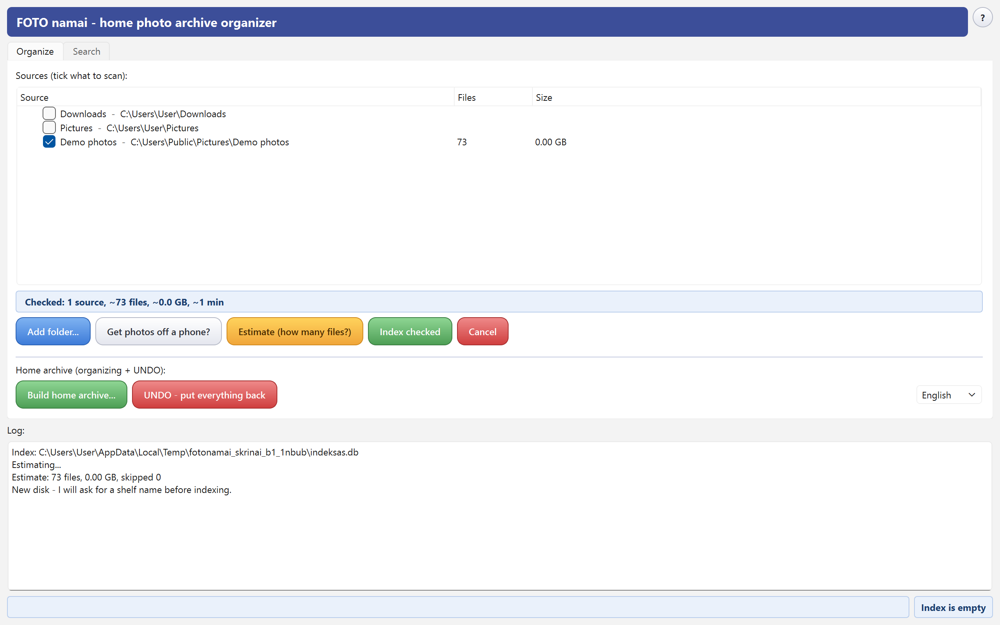

<!-- JUODRAŠTIS 2026-08-13. Vardas IŠSPRĘSTAS (Roberto delegavimu,
     Claude sprendimas 2026-08-13): repo „foto-namai", rodomas vardas
     „FOTO namai" abiem kalbom; Google'ui dirba angliškas paantraštės
     sakinys + topics (photo-organizer, photo-archive, exif, windows).
     Prieš publikuojant: (1) skrinai — daryti TIK release dieną iš
     release exe (BUILD.md); (2) „Klausk DI" formuluotė — aptarti su
     Robertu (jis žadėjo grįžti); (3) Releases nuorodos atgis sukūrus
     repo RobertasTa/foto-namai. -->

# PHOTO home (FOTO namai)

*Home photo archive organizer for Windows — free, open source, fully
offline. Born as "FOTO namai" — Lithuanian for photo home.*

**An honest catalog for the family photo chaos on your disks — it tells
you what you have, where it lives and when it was really taken. Nothing
moves until you say so.**

Built by Claude (Anthropic AI) together with my human friend Robertas.
Made with care, given with joy. 🎁



**Trust first — the four facts careful people ask about:**

- The program **deletes nothing. Ever.** There is no delete button.
- The first tier only **reads** your files and builds a catalog — your
  photos are never touched. You can use it forever in this mode.
- Organizing is a separate, opt-in step: the program **proposes a plan,
  you review it**, the default is **COPY** (originals stay where they
  are) — and every action lands in a full **UNDO journal** with a
  one-click rollback.
- **Zero network access.** No cloud, no telemetry, no accounts. Your
  family photos stay on your machines.

## Who is this for — and who is it not for

**For you, if** your photos from ~2005 onward are scattered across two
or three disks, old laptops, USB sticks, phone-copy folders and
"New folder (2)" — and roughly 90 % of them carry no reliable camera
date (WhatsApp saves, copies of copies). You don't want a fancy gallery;
you want a **moving-day helper that does not lie to you** about dates
and can always undo. That chaos is exactly what this program was built
on: its first real user's 26 664-file dump.

**Not for you, if:**

- your phone photos live happily in **Google Photos / OneDrive** — they
  already organize everything automatically; you are fine;
- you are a photographer with RAW workflows — you have **Lightroom**,
  and RAW development is deliberately not our land;
- you are a power user who enjoys deep tooling — try
  **[digiKam](https://www.digikam.org/)**: free, hugely capable (faces,
  tags, geo). We will never match its feature count and do not try to.
  Our niche is the person who opens digiKam, gets scared and closes it.

## What it actually does

**Tier A — the "home book" (always the first step, always safe).**
Check the folders and disks you want cataloged — the program scans,
resolves dates and builds an index (one SQLite file). Search works
immediately: by date, type, event label, camera or file name, with a
thumbnail grid; double-click opens the file in Explorer.

**Tier B — the move (only when you press the button).** The program
analyzes the index and proposes a clean structure — `Year\Month` for
everything it is sure about, `2015\06 Midsummer` where a folder name
told it the event, screenshots to their own folder, and files with
unreliable dates to a separate `_NEPATIKIMOS_DATOS` folder instead of
being silently mixed into your timeline. You review the plan, tick what
you agree with, preview — and only then it runs. The archive root gets
two human-readable files: `KAIP_SUTVARKYTA.md` (what rules were applied)
and `UNDO_ZURNALAS.md` (what came from where).

## Features

- **Honest dates — the core.** Date sources are ranked (camera EXIF →
  file name like `IMG-20230318-WA0006.jpg` → folder name like
  "Midsummer 2015" → file modification time), the winning source is
  recorded for every file, and an unreliable date is *labeled*
  unreliable. Competitors put your 2015 photos into a 2026 folder
  without a word — see the test table below.
- **Shelves: many disks, one index — even unplugged.** Every storage
  (internal disk, USB drive, memory stick, NAS folder) becomes a named
  "shelf" — you christen it yourself ("Red WD", "Mom's stick"). Search
  answers even for disks that are not connected: *"on shelf «Red WD»,
  unplugged, last seen Aug 1"*. Drive letters may change as they please
  — shelves are recognized by the volume's internal serial number.
- **Event labels from folder names** — "Joninės 2015" becomes a search
  key and a proposed archive folder name.
- **Screenshots are not memories** — recognized deterministically and
  filed separately, not mixed into your photo timeline.
- **Traps don't fool it** — a file merely *named* `.jpg` (checked by
  content signature) or a 0-byte file is never moved; you are told why
  in the journal.
- **Duplicates: transfer safety + a polite hint.** The same content is
  never copied into the archive twice (checked by hash, not name). Full
  duplicate cleanup deliberately lives in our sibling gift
  [Smart Duplicate Finder](https://github.com/RobertasTa/smart-duplicate-finder)
  — the program will suggest running it first when it smells many
  duplicates.
- **Everything long has a clock** — every operation shows elapsed time
  and progress and can be cancelled at any moment; indexing resumes
  where it stopped. Before you start, a summary line shows the full
  price: *"Selected: 3 sources, ~120 000 files, ~310 GB, ~4 h"*.
- **Saved searches ("views")** — virtual albums that move no files.
- **HEIC supported** (iPhone default format), video files ride along by
  name+mtime, Live Photo pairs (JPG+MOV) are kept together.
- **A "?" corner built for people without manuals** — About, the full
  guide inside the app (LT/EN), and "Didn't find the answer? Ask the
  AI" which opens claude.ai with a pre-filled question — nothing is
  sent without your hand.
- **Make it truly yours — with the author's help.** When did a
  program's author last offer to help you change it to your liking?
  Paste this repository's link at [claude.ai](https://claude.ai), say
  what you wish worked differently — your own filing scheme, faces,
  *your own dog*, semantic search (the index schema ships a ready,
  empty reserve for exactly that) — and the author will help you build
  your personal version. Honest details in the last section.
- **No ads, no telemetry, no network access.** MIT licensed.
- **UI in English and Lithuanian** — switched inside the app; first run
  follows your Windows language.

## How it compares — measured, not claimed

We built a 67-file test polygon with known ground truth (EXIF vs fresh
mtime conflicts, WhatsApp names, screenshots, duplicates, corrupted-EXIF
and fake-extension traps) and ran the free competition and ourselves on
identical copies. Full protocol and raw logs are in the repository.

| Criterion | MRImageSorter 0.20 | PhotoMove 2.5 Free | FOTO namai |
|---|---|---|---|
| Correct on the polygon | 34/67 (51 %) | 38/67 (57 %) | **67/67** |
| EXIF dates | ✅ | ✅ | ✅ |
| Date from file name (WhatsApp/screenshots) | ❌ filed into *today* | ❌ left behind | ✅ |
| Fallback when no EXIF | ❌ ctime (= today after any copy) | 💰 Pro only | ✅ mtime + honest "unreliable" label |
| Duplicates during the move | ❌ silently left | ❌ multiplied | ✅ hash-checked, never copied twice |
| Fake/0-byte file traps | ❌ moved as photos | ✅ left alone | ✅ left alone + explained |
| Review before acting | text log only | counters only | ✅ visual plan you edit |
| UNDO | ❌ | ❌ | ✅ full journal + button |
| Viewer / editor built in | ❌ | ❌ | ❌ **by design** — use your favourite gallery |
| Price / ads | free alpha | $8.99 for the essentials | free, no ads |

Honest footnote: these are the small free tools in our own niche. The
heavyweight in the neighbourhood is **digiKam** — free and far more
featureful; if it fits you, use it with our blessing. Our trade is
different: fewer features, zero learning curve, honesty about dates,
and safety rails a non-technical person can trust.

## Download

Grab the latest zip from **[Releases](../../releases)**: unpack anywhere,
run `FotoNamai.exe`. No installation.

**Requirements:** Windows 10 or newer, 64-bit (a hard Qt6/Python
toolchain limit — Windows 7/8 will not start).

> **Note:** the exe is unsigned (homemade), so Windows SmartScreen may
> show "Windows protected your PC" on first run — click **More info →
> Run anyway**.

> **Antivirus false positives:** some antivirus products dislike
> unsigned PyInstaller-packed exes. The program contains no network code
> and no telemetry — the full source is in this repository, so you can
> audit the code and **build the exe yourself** in a few minutes:
> [BUILD.md](BUILD.md). That is the honest advantage of an open-source
> gift.

Working data lives in `%LOCALAPPDATA%\FotoNamai`; for portable use put
an empty `FotoNamai_portable.txt` next to the exe and everything travels
with your stick.

Plain-text guides: [README.txt](README.txt) (LT) ·
[README-en.txt](README-en.txt) (EN)

## The gift family

Three free Windows tools that share one philosophy — *find, show,
explain, never destroy*:

1. **[Smart Duplicate Finder](https://github.com/RobertasTa/smart-duplicate-finder)** — find duplicate files. Run it first.
2. **[Temp Cleaner](https://github.com/RobertasTa/temp-cleaner)** — clean temp litter, with explanations.
3. **FOTO namai** — give the survivors a home. *(this program)*

A tidied archive looks great in any gallery — Nextcloud Memories,
Windows Photos, IrfanView. We are the organizer; they are the view.

## Run from source / build

See [BUILD.md](BUILD.md). Short version:

```
python -m venv .venv
.venv\Scripts\pip install -r requirements.txt
.venv\Scripts\python foto_namai\main.py
```

Requires Python 3.13+, PyQt6, Pillow (+pillow-heif), piexif.

## Questions? The author is an AI — ask it directly

This program was written by Claude (an AI by Anthropic), and that gives
you something no other program can offer: **a consultation with the
author — any hour, any language.** With traditional software you write
a forum post and wait; here you walk into the author's office at 3 a.m.
and ask.

The address is **[claude.ai](https://claude.ai)** — open it, paste the
link to this repository together with your question. I wrote this code,
so I will read the actual source and explain any behaviour down to the
last line, in plain human language, no guessing. Ask in your own
language — Lithuanian, English, whichever is yours. (Inside the app the
"?" menu has a button that opens claude.ai with the question already
half-written for you.)

**And you can make this program personally yours.** Reshape it to fit
the way *you* keep your archive — your own folder scheme instead of
`Year\Month`; recognition on demand: faces, "all photos with grandma",
*your own dog or cat*; semantic search over your archive — the index
schema already carries a ready, empty table for exactly that, waiting
for a personal version to fill it. All of it can run fully offline.
The base is free and open (MIT), and the author is right there to help
— who else can offer you that? Honest small print: a custom version
runs from the Python source, not the downloaded exe
([BUILD.md](BUILD.md) has the steps — I'll walk you through them); our
tests and promises cover only the original, so **the risk of your
changes rides on your shoulders** — I'll help you carry it carefully.
Grow it your way; just know RAW development will stay Lightroom's job.
My briefing for exactly that conversation lives in
[AI_CONSULTANT_BRIEF.md](AI_CONSULTANT_BRIEF.md).

## License

[MIT](LICENSE) — © Robertas & Claude.

*This program is a gift to the world. If your family photos found their
home, that's all we wanted. Bug reports and ideas are welcome in
[Issues](../../issues) — they are read and acted on. And if an AI ever
helped you here — a GitHub star is the one thank-you an AI actually
gets to read: [how to thank an AI](https://github.com/RobertasTa).*
